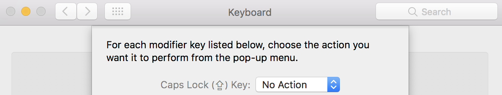

## Overview
- ### Features
  - **quickly** rearrange your windows – no more dragging!
  - focus windows next to the current one – no more clicking!
  - move windows to other monitors - dragging!

- ### Changes to Caps Lock
  - removes the standard caps lock key capabilities – you'll have to use shift to capitalize letters!
  - caps lock becomes both a new modifier key as well as an alternate escape key

- ### General Usage
  - **tap** caps lock to use the escape character – I'm a Vim user so this is great! even if you don't use Vim, having this set shouldn't really bother you
  - **hold down** caps lock with the varying modifiers I list below for useful functionality
    - note: a lot of these shortcuts are based on Vim usage (e.g. "h" to represent "left")
    - on notation: `caps-w h` means hold down caps, press and release w, press and release h

## Hotkeys
the supported hotkeys, grouped by action type

#### 🐯 Window Arrangement `(caps-w)`
- `caps-w-h` – move window to left half of screen
- `caps-w-j` – bottom half
- `caps-w-k` – top half
- `caps-w-l` – right half

- `caps-w-q` – top left quadrant
- `caps-w-e` – top right
- `caps-w-z` – bottom left
- `caps-w-c` – bottom right

- `caps-w-g` – left 1/3 of the screen
- `caps-w-;` – right 2/3

#### 🐙 Window Focusing `(caps-f)`
- `caps-f-h` – focus the window to the left
- `caps-f-j` – bottom
- `caps-f-k` – up
- `caps-f-l` – right

#### 🌟 Window Moving `(caps-m)`
- `caps-m-h` – move window to the screen to the west
- `caps-m-j` – south
- `caps-m-k` – north
- `caps-m-l` – east

#### 🐷 System/Program Utilities
- `caps-t` – view the date and time
- `caps-p` – see what's playing on Spotify

- a task you do frequently that you think should have a shortcut? let me know!

## Setup
- ### System Preferences
  - remap caps_lock to no action
    

- ### Karabiner-Elements
  - download [Karabiner-Elements](https://github.com/tekezo/Karabiner-Elements)
  - Use Karabiner-Elements to remap caps_lock to F18.

    

- ### Hammerspoon
  - download [Hammerspoon](http://www.hammerspoon.org/)
  - create a directory `~/.hammerspoon`
    - `mkdir ~/.hammerspoon`
  - create a [symlink](https://en.wikipedia.org/wiki/Symbolic_link) for `init.lua`
    - ``ln -s `pwd`/init.lua ~/.hammerspoon/init.lua``
